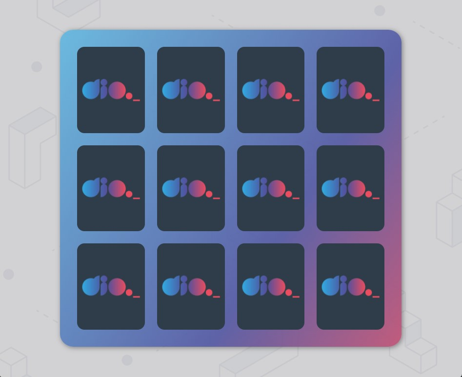
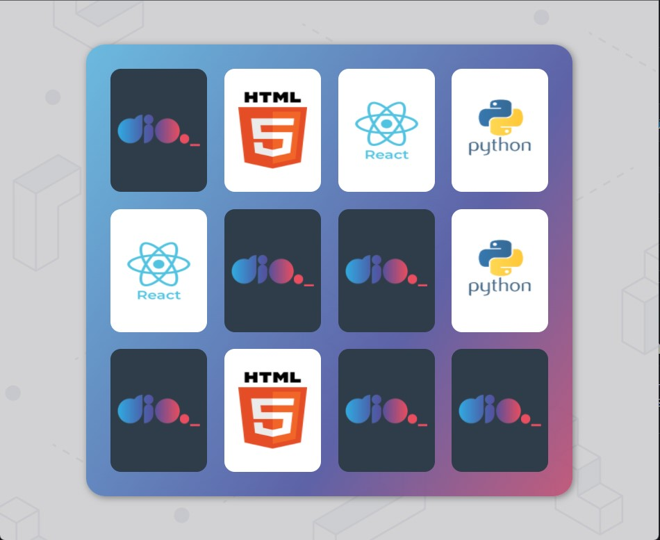
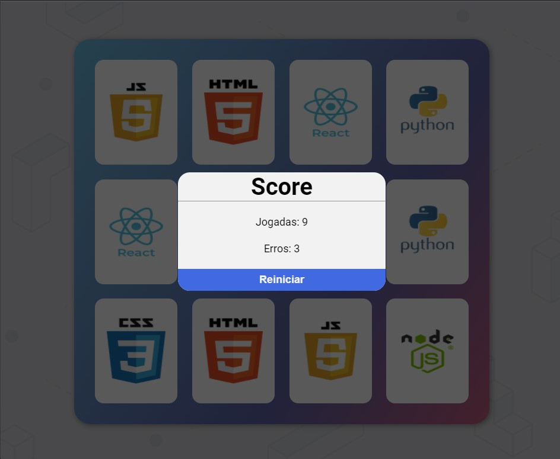

<h1 align='center'>JOGO DA MEMÓRIA</h1>

 Desafio do bootcamp da Digital Innovation One, criar um jogo da memória.

## Tecnologias usadas:
 - ``HTML 5``
 - ``CSS 3``
 - ``Javascript``

## Utilização
* Baixe o arquivo no link [jogo da memória](https://github.com/fredcsouza/jogo-da-memoria-dio/archive/refs/heads/master.zip), descompacte e execute o arquivo index.html.
* Ou acesse o jogo no github pages: [Jogo da memória](https://fredcsouza.github.io/jogo-da-memoria-dio/)

## Preview
 

